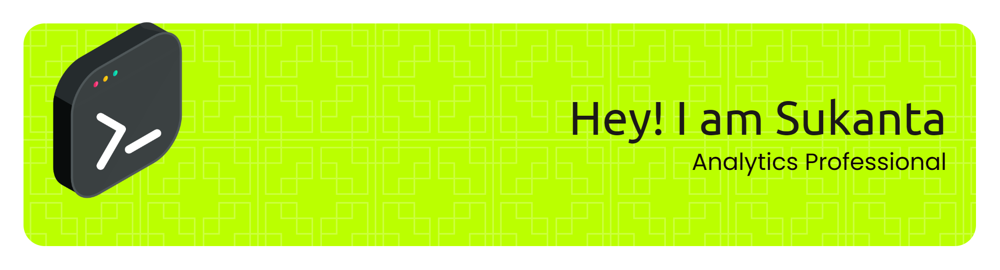

<h1 align="center">👋 Hi, I'm Sukanta Swain</h1>
<h3 align="center">Credit Risk | ESG | Data Analytics | AI Enthusiast</h3>

---

### 🚀 About Me
- 💼 Business Analyst in Finance, ESG & AI
- 🌱 Exploring **Agentic AI** and **Data Visualization**
- 🎯 Building educational projects in **Excel | Python | R | Manim | Looker Studio**
- 🧠 Passionate about **teaching**, **analytics**, and **responsible AI**

---

### 🌐 Connect with Me

  
  
  
  
  

---

### 🧰 Languages & Tools

  

---

### 📊 GitHub Stats

  
  

---

### 🧠 Latest Projects
- 🔹 [Python for Excel Course](https://github.com/sukantaswain/python-for-excel)
- 🔹 [R for Credit Risk Analysis](https://github.com/sukantaswain/r-creditrisk)
- 🔹 [Looker Studio Dashboards](https://github.com/sukantaswain/looker-tutorial)
- 🔹 [Odia Educational Projects](https://github.com/sukantaswain/excel)

---

### 🎨 Fun Section: Contribution Graph & Trophy

  
  

---

### ❤️ Support My Work
If you like my work, consider following or starring my repositories 🌟

<!--
**Sukanta-Swain/Sukanta-Swain** is a ✨ _special_ ✨ repository because its `README.md` (this file) appears on your GitHub profile.

Here are some ideas to get you started:

- 🔭 I’m currently working on ...
- 🌱 I’m currently learning ...
- 👯 I’m looking to collaborate on ...
- 🤔 I’m looking for help with ...
- 💬 Ask me about ...
- 📫 How to reach me: ...
- 😄 Pronouns: ...
- ⚡ Fun fact: ...
-->
